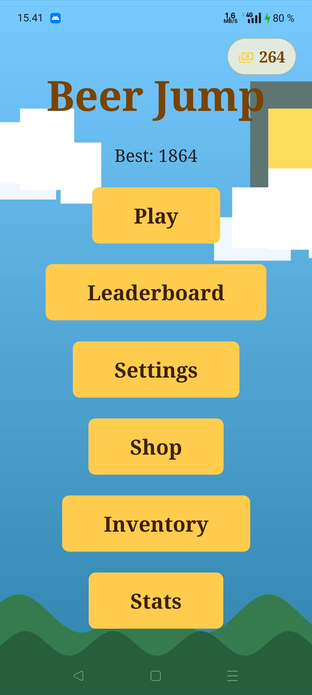
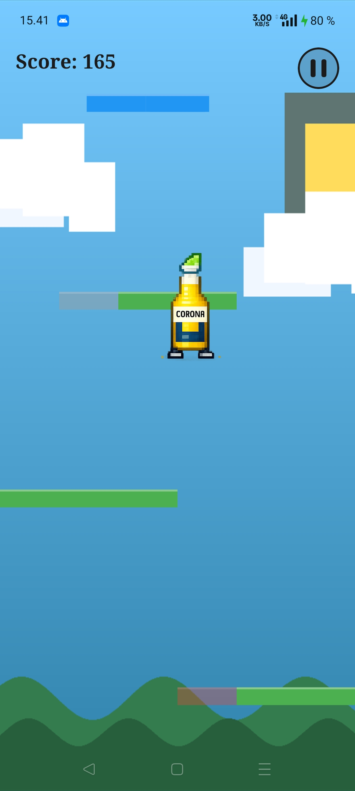

# Beer Jump

A Doodle Jump-inspired endless vertical platformer built with React Native and Expo.  
Jump upward across procedurally generated platforms, collect beer-themed power-ups, stomp enemies, and compete on a global leaderboard.

> **School project** Oulu University of Applied Sciences  
> Mobile Development Project · Team R13

---

## Screenshots

<div style="display: flex; gap: 20px; justify-content: center;">
  
  
</div>

---

## Gameplay

- Tilt your phone or use on-screen touch zones to move left and right
- Bounce automatically on every platform you land on
- Reach as high as possible without falling off the bottom of the screen
- Stomp enemies by landing on top of them
- Collect power-ups sitting on platforms for a temporary advantage
- Your personal best is saved and synced to the global leaderboard

### Power-ups

| Power-up          | Effect                                                      |
| ----------------- | ----------------------------------------------------------- |
| **Pretzel Boots** | One mega-bounce 3× normal jump height                       |
| **Foam Hat**      | Slow upward float for 4 seconds                             |
| **Jetpack**       | Strong sustained ascent for 5 seconds + enemy invincibility |
| **Bottle Rocket** | Short violent burst upward + enemy invincibility            |

### Platform types

| Platform        | Behaviour                                |
| --------------- | ---------------------------------------- |
| 🟩 Static       | Always there to land on                  |
| 🟦 Moving       | Moves horizontally                       |
| 🟥 Breakable    | Crumbles after one bounce                |
| 🟧 Disappearing | Pulses in and out always collidable      |
| ⬜ Fake         | Fall straight through the platform       |

---

## Tech Stack

| Area        | Technology                                                                                                             |
| ----------- | ---------------------------------------------------------------------------------------------------------------------- |
| Framework   | [React Native](https://reactnative.dev/) + [Expo](https://expo.dev/) SDK 54                                            |
| Language    | TypeScript (strict)                                                                                                    |
| Game engine | [React Native Reanimated](https://docs.swmansion.com/react-native-reanimated/) `useFrameCallback` (UI thread worklets) |
| Rendering   | [React Native Skia](https://shopify.github.io/react-native-skia/) procedural `createPicture`                           |
| State       | [Zustand](https://zustand-demo.pmnd.rs/) (app state) + Reanimated shared values (game loop)                            |
| Backend     | [Firebase](https://firebase.google.com/) Firestore + Anonymous Auth                                                    |
| Navigation  | [React Navigation](https://reactnavigation.org/) single permanent screen + overlay pattern                             |
| Sensors     | `expo-sensors` Accelerometer for tilt input                                                                            |
| Audio       | `expo-av`                                                                                                              |

---

## Architecture Highlights

### Permanent Screen Model

All UI home menu, game over, HUD, leaderboard, settings, shop, inventory is rendered as `StyleSheet.absoluteFillObject` View overlays inside a single `GameScreen` that **never unmounts**. This was the solution to a confirmed Reanimated 4.1.x bug where `useFrameCallback` accumulated registrations on every screen remount, causing game speed to multiply with each run.

### Game Loop

The physics tick runs entirely on the UI thread via `useFrameCallback` at ~60fps. The JS thread is never touched during active gameplay only at death via a single `runOnJS` call.

### Object Pools

Platforms, enemies, and power-ups are fixed pre-allocated arrays mutated in place every frame.

### Seeded Generation

Platform layout is procedurally generated using a seeded generator at run start. The same seed always produces the same layout.

### Difficulty Scaling

Five tiers with increasing platform density reduction, harder type mixes, and more enemies all wired into the generator via `DifficultyScaler.getDifficultyConfig(rowsGenerated)`.

---

## Getting Started

### Prerequisites

- Node.js 18+
- Expo Go app on your iOS or Android device
- A Firebase project (see configuration below)

### Installation

```bash
git clone https://github.com/mobiilikehitysprojekti-R13/Beer-Jump.git
cd Beer-Jump
npm install
```

### Firebase configuration

Create a `.env` file in the project root based on `.env.example`:

```env
EXPO_PUBLIC_FIREBASE_API_KEY=your_api_key
EXPO_PUBLIC_FIREBASE_AUTH_DOMAIN=your_project.firebaseapp.com
EXPO_PUBLIC_FIREBASE_PROJECT_ID=your_project_id
EXPO_PUBLIC_FIREBASE_STORAGE_BUCKET=your_project.appspot.com
EXPO_PUBLIC_FIREBASE_MESSAGING_SENDER_ID=your_sender_id
EXPO_PUBLIC_FIREBASE_APP_ID=your_app_id
```

### Running

```bash
# Start Expo dev server
npx expo start
```

> The game requires a physical device. Touch controls work on emulator but tilt will be inactive.

---

## Project Structure

```
src/
├── components/
│   ├── game/
│   │   └── GameCanvas.tsx        # Skia rendering
│   └── ui/                       # All overlay screens
├── constants/
│   ├── gameConfig.ts             # All gameplay tuning values
│   └── theme.ts
├── engine/
│   ├── useGameLoop.ts            # Frame callback + physics tick
│   ├── physics.ts                # Worklet physics functions
│   ├── PlatformGenerator.ts      # Procedural generation
│   └── DifficultyScaler.ts       # Tier-based difficulty config
├── hooks/
├── screens/
│   └── GameScreen.tsx            # Permanent root screen
├── services/firebase/            # Auth, Firestore, leaderboard, shop
├── state/
│   ├── appStore.ts               # Zustand store
│   ├── gameValues.ts             # Reanimated shared values
│   └── types.ts
└── utils/
```

---

## Team

| Name            |
| --------------- |
| Leevi Määttä    |
| Tomi Roumio     |
| Juho-Pekka Salo |
